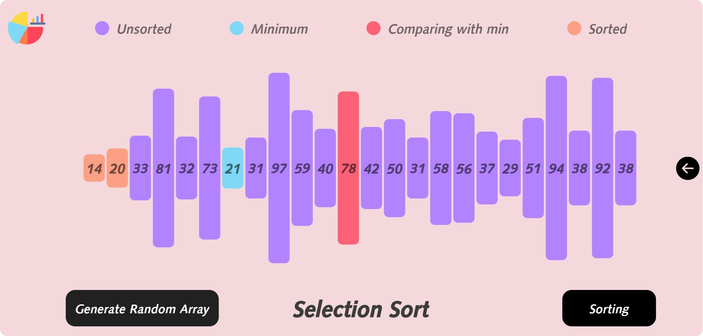

[<h1 style="font-size:60px; width:100%;">DSA Visualizer</h1>](./appIcon.png)

# ⚙️ Visual Representation of Data structure & Algorithm ⚙️

### Sorting Visualizer:
[</img>](./assets/ui/sorting.png)

### Finished Visualizer:
* Sorting :
  * Selection Sort
  * Bubble Sort